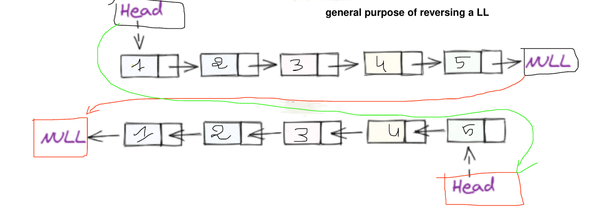
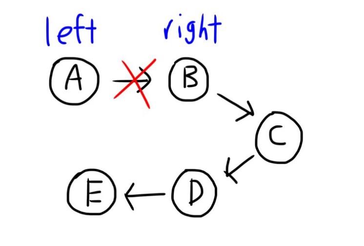
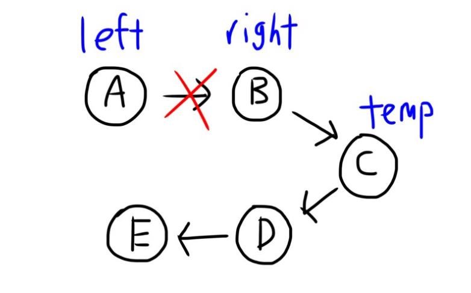
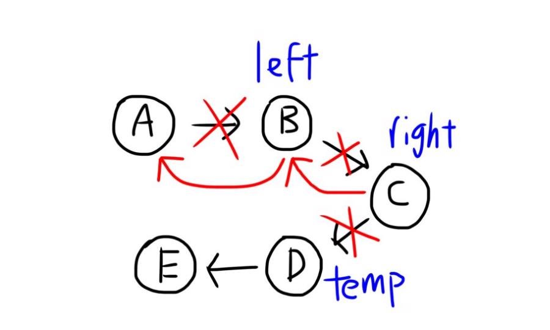
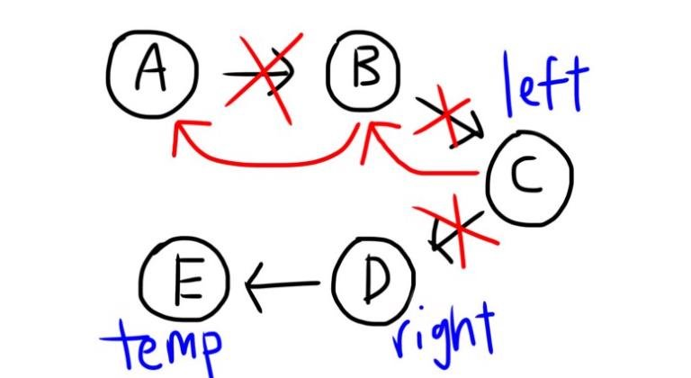
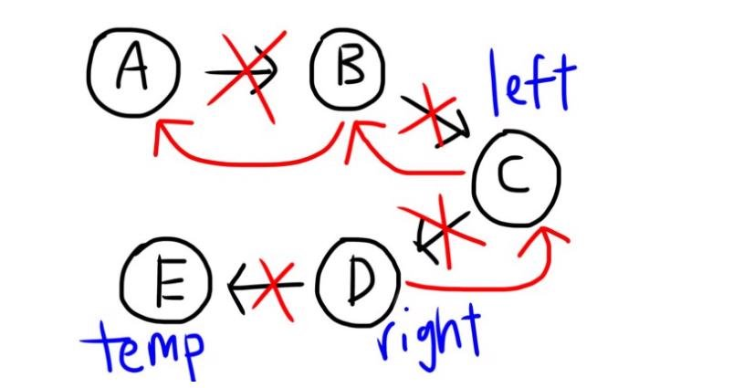
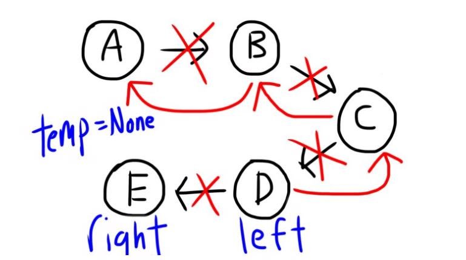
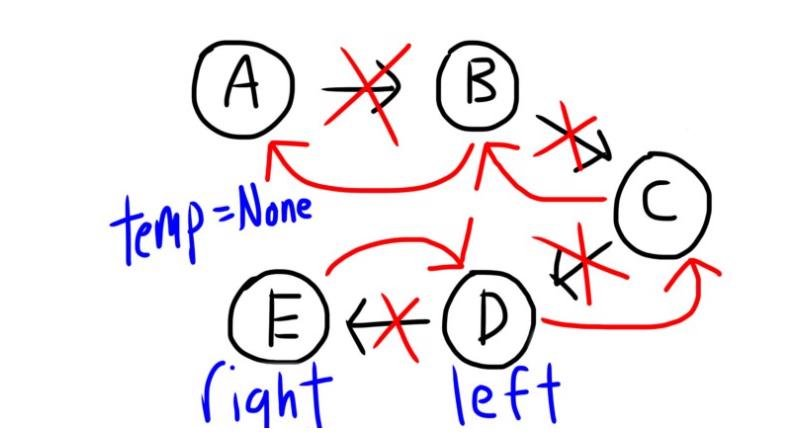
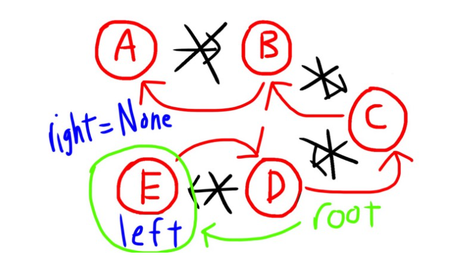

# How to Reverse a Linked List Process

*Created by Yohan Hmaiti.*

Assign left=root (A) and right=root.next (B)

Assign temp=right->next; (C)

right->next = left (B)

B now points to A. Remember the red arrows are for the reversed list :)

Move left, right and temp to the following node for each one (to the right by 1)!

right->next = left (C)

C now points to B!

Shift all our nodes by 1 to the right!

right->next = left (D)

D now points to C!

Shift all the nodes by 1 to the right!

right->next = left, so now E now points to D!

Then return the root :)!

