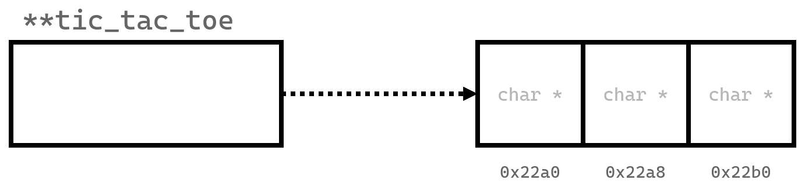

## Review of 1D Arrays

Remember arrays? Hopefully you do, but here's a very quick refresher:

Arrays represent a collection of items, usually with the same datatype. Here's our array of grades example from before:

```c
float grades[5];
grades[0] = 92.5;
grades[1] = 52.4;
grades[2] = 75.0;
grades[3] = 82.0;
grades[4] = 88.9;
```

```
   grades[0]    grades[1]    grades[2]    grades[3]    grades[4]
+------------+------------+------------+------------+------------+
|    92.5    |    52.4    |    75.0    |    82.0    |    88.9    |
+------------+------------+------------+------------+------------+
```

This specific array, of type `float`, and a size of 5 represents a *one-dimensional* list of grades. A single row, if you will. However, there are some cases where
we might need more than one dimension. Let's say you wanted to represent a grid of some kind, like in tic-tac-toe. We *could* just create another one-dimensional array of size 9, but we would have to always keep track of what row and column we're on, since a one-dimensional array only allows us to access the element with just a single index. 

However, what if I told you that C allows you to create multi-dimensional arrays? One of the main advantages of this, for instance, is that we can access array elements using their "row" and "column". 

---

## Basics of 2D Arrays

Take a look at this example:

```c
char tic_tac_toe[3][3]; // create a 3x3 two-dimensional array for tic-tac-toe purposes
```

This creates an empty two-dimensional array, with 3 rows and 3 columns. Labeled is a representation of the grid, with the row indexes and column indexes labeled:

```
             column index
            0      1      2
         +-----+-----+-----+
      0  |     |     |     |
         +-----+-----+-----+
row   1  |     |     |     |
index    +-----+-----+-----+
      2  |     |     |     |
         +-----+-----+-----+
```

Let's say that we want to put an `X` in the bottom left cell:

Remember, array indexes start at 0. So although we have three rows and three columns (a 3x3 grid), we must remember to start each index at 0. 

```c
tic_tac_toe[2][0] = 'X' // set an 'X' in the third row, first column of the 2d array
```

Now, our grid looks like this:

```
             column index
            0      1      2
         +-----+-----+-----+
      0  |     |     |     |
         +-----+-----+-----+
row   1  |     |     |     |
index    +-----+-----+-----+
      2  |  X  |     |     |
         +-----+-----+-----+
```

As you can see, we've just placed an 'X' onto the bottom left of our 2D array!

---

## Iterating Through Information in a 2D Array

To print information from a 2D array in C, you can follow the same concept you might use when printing a 1D array. For instance, you probably understand that this will print the array, `arr`, in a linear fashion, separated by spaces:

```c
#include <stdio.h>

int main(void) {

    int arr[] = {1, 2, 3, 4, 5};

    for (int i = 0; i < 5; i++) {
        printf("%d ", arr[i]);
    }

    printf("\n");
    return 0;
}
```

Now, let's think back to our tic-tac-toe example. If we must keep track of both row and column index, how could we construct our new for loop?

Trick question! We would need multiple for loops! Specifically, we would need to nest two for loops together. Take a look at the following code:

```c
#include <stdio.h>

int main(void) {

    char tic_tac_toe[3][3];
    tic_tac_toe[2][0] = 'X';

    for (int i = 0; i < 3; i++) {
        for (int j = 0; j < 3; j++) {
            printf("%c ", tic_tac_toe[i][j]);
        }
        printf("\n");
    }

    return 0;
}
```

To explain what's going on, let's walk through the important bits:

```c
    char tic_tac_toe[3][3];
    tic_tac_toe[2][0] = 'X';
```

Here, we're just creating our tic-tac-toe 2D `char` array, with a size of 3x3. Then, we're setting the character at the third row, first column to 'X'. Remember, arrays in C start at 0!

```c
    for (int i = 0; i < 3; i++) {
        for (int j = 0; j < 3; j++) {
```

This may look a little strange, but all that is essentially going on these two lines is that we're setting up the first, "outer" loop so that we start at i = 0, all the way to i = 2, then increment. Then, for each iteration of that outer loop, we are also looping through _another_ loop located inside that first loop. So, if we track the variables:

```
i-index  j-index  (i, j)
________________________

i = 0    j = 0    (0, 0)
         j = 1    (0, 1)
         j = 2    (0, 2)
                        <- finished inner loop, now we i++
i = 1    j = 0    (1, 0)
         j = 1    (1, 1)
         j = 2    (1, 2)
                        <- again, finish inner loop, now we i++
i = 2    j = 0    (2, 0)
         j = 1    (2, 1)
         j = 2    (2, 2)
                        <- both i and j have reached their terminating conditions
```

You'll see that for every iteration of `i`, we finish up the inner loop first (e.g. by incrementing until we reach the end condition), then finally going back to the outer loop and incrementing it's counter.

Now, you may realize something: if we look at (i, j) when tracking the variables, the indexes line up with the positions on our tic-tac-toe grid, at least in terms of accessing them, like we did with `tic_tac_toe[2][0] = 'X'`. For instance, (0, 0) represents the top-left, (0, 1) represents the cell right next to that, (0, 2) then is the top-right, etc.

We now have a way to generate the indexes of all of the possible cells in our 2D array for tic-tac-toe! So, now, we can look at the next line:

```c
            printf("%c ", tic_tac_toe[i][j]);
```

Here, we print a single character (with a space after it), by accessing what's in our 2D array. Just like what we did before, when trying to assign 'X' to `tic_tac_toe[2][0]`, in this line of code, we access the character in `tic_tac_toe[i][j]`. For instance, if we randomly stopped the program from running when i = 2 and j = 0, we would see that the character at `tic_tac_toe[2][0]` is, in fact, `X`.

Now, there is one problem that I am ashamed to admit: if we ran this right now, it would compile and run, but we'd get output like this:

```


X
```

Technically, our program works, it's just that I forgot to initialize each cell in our tic-tac-toe 2D array with a value (oops!) so right now they're all "empty", except of course, `tic_tac_toe[2][0]`. This doesn't really look all that great though, and it's hard to discern where all the cells are. However, with your newfound knowledge, perhaps you could help me!

Click the text below to see a potential solution!

<details>
<summary>Show code</summary>

```c
for (int i = 0; i < 3; i++) {
   for (int j = 0; j < 3; j++) {
      /* initalize the char at the row, col of tic_tac_toe 
      to an underscore for better readability */
      tic_tac_toe[i][j] = '_';
   }
}
```

Of course, you could have used another character, or maybe you're content with just using a space, but remember to initialize your values, else you could accidentally end up reading garbage values!

</details>

Finally, when we run our program, we get the following output:

```
_ _ _
_ _ _
X _ _
```

Wow! A tic-tac-toe grid. If we really wanted to, we can even start to play a full game of tic-tac-toe by assigning values:

<details>
<summary> Show (bad) code and output </summary>

```c
tic_tac_toe[2][0] = 'X';
tic_tac_toe[0][0] = 'O';
tic_tac_toe[1][0] = 'X';
tic_tac_toe[0][1] = 'O';
tic_tac_toe[2][1] = 'X';
tic_tac_toe[2][2] = 'O';
tic_tac_toe[1][2] = 'X';
tic_tac_toe[1][1] = 'O';
tic_tac_toe[0][2] = 'X';
```

```
O O X
X O X
X X O
```

</details>

Of course, you *_really_* don't want to manually have to edit your source code and recompile your program every time you make a move. Perhaps you can try extending your program to accept input from the user, and make this a full, playable tic-tac-toe game!

<details>
<summary>Show final code</summary>
Assuming you used `_` as a separator, and your final code may look something like this:

```c
#include <stdio.h>

int main(void) {

    char tic_tac_toe[3][3];
    for (int i = 0; i < 3; i++) {
        for (int j = 0; j < 3; j++) {
            tic_tac_toe[i][j] = '_';
        }
    }
    // find a better way to do this!! 
    // I can't just keep recompiling every time I make a move!
    tic_tac_toe[2][0] = 'X';
    tic_tac_toe[0][0] = 'O';
    tic_tac_toe[1][0] = 'X';
    tic_tac_toe[0][1] = 'O';
    tic_tac_toe[2][1] = 'X';
    tic_tac_toe[2][2] = 'O';
    tic_tac_toe[1][2] = 'X';
    tic_tac_toe[1][1] = 'O';
    tic_tac_toe[0][2] = 'X';

    for (int i = 0; i < 3; i++) {
        for (int j = 0; j < 3; j++) {
            printf("%c ", tic_tac_toe[i][j]);
        }
        printf("\n");
    }

    return 0;
}

```
</details>

---

## Dynamically Allocating 2D Arrays

If you haven't learned about dynamically allocating memory yet, then this section may not make much sense.
Consider viewing the section on **Pointers and Dynamic Memory Allocation** first.

However, if you have, then this section will detail some of the thought behind dynamically allocating multi-dimensional arrays.

---

### Syntax

_Note_: There are a multitude of ways to implement 2D arrays in C. This is simply one of them, which may not be the most efficient.

Before, we saw how to create a 2D array in the stack space, like the following example below:

```c
char tic_tac_toe[3][3];
```

Of course, this only creates a 2D array in the _stack space_. Let's try to create our tic-tac-toe array in the heap with `malloc` (assuming you already have `#include <stdlib.h>`).

```c
char **tic_tac_toe = malloc(sizeof(char *) * 3);
```

Let's draw out what's currently happening:



We now have a double pointer, `**tic_tac_toe`, which holds an address that points to our _array_ of `char` pointers. We aren't done yet, however. So far, we've only laid out the foundation of what will become our 2D array. 

If you've been paying close attention, you might realize that each "cell" in our `**tic_tac_toe` array of `char *` could be made into arrays. And that's exactly what we'll do: for each `char *` cell in `**tic_tac_toe`, we can initialize (using `malloc` again) a new array of `char`, thus finally finishing the initialization of our 2D array.


How would we do that? Well, you could individually access each `char *` cell, `malloc` a new `char` array for each, and then eventually place a value inside each cell. It's a bit tedious, but I'll explain it here:

```c
// create the "double pointer" that points to an array of (empty) arrays
char **tic_tac_toe = malloc(sizeof(char *) * 3);
// individually access each cell of tic_tac_toe (which are of type (char *))
// so that we can then allocate space in each cell for char arrays
tic_tac_toe[0] = malloc(sizeof(char) * 3);
tic_tac_toe[1] = malloc(sizeof(char) * 3);
tic_tac_toe[2] = malloc(sizeof(char) * 3);
// finally, we can access each element like a 2d array:
tic_tac_toe[0][0] = 'X';
```

Of course, you may know now that you could also use a loop to automate our `malloc` calls for each cell in `**tic_tac_toe`, so for instance, you might do something like this:

```c
char **tic_tac_toe = malloc(sizeof(char *) * 3);
for (int i = 0; i < 3; i++) {
    tic_tac_toe[i] = malloc(sizeof(char) * 3);
}
```

---

### Freeing

Since we used `malloc`, we need to properly free our memory, or else we could get spooky memory leaks! Using the previous example, freeing is simple:

1. First, free each individual `char *` in `**tic_tac_toe`. Here, we'll use a loop to make things less tedious:

```c
for (int i = 0; i < 3; i++) {
    free(tic_tac_toe[i]);
}
```
2. Then, free `tic_tac_toe` itself. 

```c
free(tic_tac_toe);
```

We now have freed all the necessary memory we `malloc`'d!

---