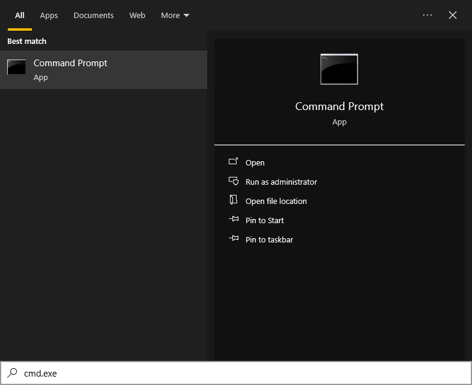

_Note: This page does not adhere to the the [**evergreen**](https://github.com/wikiknights/cs-materials/wiki/Document-Contents#evergreen-content) principle. This means that content in this page may become out of date due to changes in the programs featured in this page, or just general passage of time. Currently this is up to date as of September 27th, 2023._

# Prerequisites 

This guide assumes the following:

- You have access to the internet

- Your operating system is Windows 10 or newer, and you have a 64-bit operating system

- You have full administrative privileges on your computer, and are able to install programs

- You have a _reasonable_ amount of storage space remaining on your computer (around 4GB should be enough, but it might be time to start cleaning up if you only have that much space left!)

# Why Install Development Tools? 

Many people wonder why they should install development tools, such as the _MSYS2_ toolkit for Windows, which includes gcc. The simple explanation is that by default, Windows does not come with the proper development toolkits needed for programming in languages such as C. When using an IDE such as Visual Studio Code, you may have run into the following error when writing your C program:


This is because Visual Studio Code cannot find the proper development tools needed to compile and run your program. Let's fix that!

# Installing Development Tools

We will install _MSYS2_ and setup the _UCRT64_ environment as our development tools. MSYS2 refers to the software (more so a collection of tools) that we will be using in order to actually build our C source files. Within MSYS2, we have different environments (such as UCRT64, CLANG64, MINGW64, etc.) 

For the scope of this tutorial, and for most people, the UCRT64 environment will work with our use cases, since we want to compile our programs natively for Windows. You can read more about the different environments [here](https://www.msys2.org/docs/environments/).

## Downloading and Installing MSYS2

<!--  -->

The latest MSYS2 installer is available at the [MSYS2 homepage](https://www.msys2.org/). Scroll down to the "Installation" header, and click the link after "Download the installer". The instructions here will mostly mimic the instructions given on the MSYS2 site, for now.

Find where you downloaded the MSYS2 installer and run it. You will get a popup that looks something like this:


Click _Next_. The installer will ask you to specify where it will install MSYS2. It's best to leave this to the default location, and this tutorial assumes that you installed MSYS2 to the default installation directory when setting the path:


Click _Next_. The installer will ask where to put MSYS2 in your start menu. You can leave it as the default name, "MSYS2":


Once again, click _Next_. The installer will now begin to install MSYS2. Depending on your hardware, this may take a while. Sit tight!


After the installer finishes, well, installing, it will bring you to the final page, and will also give an option: _Run MSYS2 now._ Make sure this option is set, then click _Finish_.


A terminal window will pop up, with a black background, and some colored text:


Currently, we are at our _shell prompt_. In the image, there's green text that reads `person@DESKTOP-VKB83SL` and purple text that reads `UCRT64`. This is just general information about who we are (`person`), our computer name (`DESKTOP-VKB83SL`), and that we're using the UCRT64 environment. Of course, this differs on a computer-by-computer basis, so your prompt will look a little different. When we see this prompt, it means that we can type commands. This'll come in handy later!

If you accidentally did not check the option, or no window popped up, no worries! Just open your start menu and search for _"ucrt64"_, then click on _MSYS2 UCRT64_.


Let's go back to that cool window earlier. This is the terminal that we will use to install the necessary packages that we will need to actually be able to compile our programs, such as _gcc_. For now, this is the only way we can access the UCRT64 environment, so make sure to keep it open for now.

Now, we need to install the actual development tools so we can compile our programs in C. In the terminal, type or copy and paste the following command:

```
pacman -S base-devel mingw-w64-ucrt-x86_64-toolchain
```

This command may look a little scary at first glance. Let's break it down:

- `pacman -S`: `pacman` is the software manager that MSYS2 uses to install other packages. If you are familiar with Arch Linux, you may recognize this command as well. The `-S` part signifies that we want to install a package.

- `base-devel`: After `pacman -S`, each spaced text signifies the package we want to install. `base-devel` is the first package, and installing it also means that it will install a few useful packages for general development use. We may not use them here, but it could come up useful later, which is why we include it.

- `mingw-w64-ucrt-x86_64-toolchain`: This is the stuff we really want. This is a package group that also includes `gcc`, a very useful compiler, `gdb`, a very useful debugger, and other useful packages for general development purposes. We _specifically_ need the _ucrt_ version of this, since we are using the UCRT64 environment.

Once you type the command into the terminal, hit _Enter_ on your keyboard. You will see a lot more text pop up:


This popup is just asking us whether we want to specifically install each package, or just all of them, since the `mingw-w64-ucrt-x86_64-toolchain` package is actually a group that holds other packages. We recommend you install everything, at least for the sake of this tutorial. There's a few things that you _probably_ don't need (at least in the scope of this tutorial), but we don't really want to cherry pick _everything_ that the package group provides. So, onwards!

Hit _Enter_ when it asks you to "Enter a selection". Not typing anything will default to installing everything that the package group provides, which is what we want to do. After we hit enter, we get _even more_ text! It even fills up the window:


This is just another prompt that displays every single package that will be installed, and whether we want to proceed with the installation. We want to install these, so just type a single `y` character into the terminal, and then hit _Enter_.


This will take a while! We're now downloading and installing all the packages that we typed earlier. Depending on your internet, this really could take a long time, so maybe you could get a snack. Or water. It's always good to stay hydrated!

After a while, we will be back to our good old shell prompt. Verify that the installation went correctly by typing `gcc` into the prompt:


If you see some text about a fatal error from `gcc.exe`, then that's great! We've installed our development tools, but we still need to do a few more steps to ensure that other programs can see these development tools.

If you type `gcc` and receive an error like `-bash: gcc: command not found`, then you can try the following:

- Try reinstalling the packages by retyping the `pacman` command from earlier. It's possible that you lost internet connection, and that caused the whole install to fail. You can simply reinstall by typing the command again.

- Double check you typed the right package names. You might've installed different packages on accident.

## Setting our Environment Variables

So far, we've installed the proper development tools, however, if you tried opening Visual Studio Code, you will notice that our C file still shows us a bunch of errors. This is because, even though we installed the proper development tools, they're only accessible in the UCRT64 environment terminal for now, since we haven't added the tools to our _PATH_.

The PATH, at least in Windows, refers to a variable that lists all the directories that should be accessible whenever a programs wants to get the PATH. Most programs will search the PATH anytime it needs to find a command or program, since it holds all the directories which hold all of our programs. So, let's add the UCRT64 environment's packages to our PATH.

Search for "environment variables" in the start menu, then select "Edit the system environment variables":


Alternatively, you can also open the _Run_ prompt (hit the `Windows Key` and `R` at the same time), type `sysdm.cpl`, then click on the "Advanced" tab.

Once you do that, you will see a window titled "System Properties". On the bottom of the window, there is a button labeled "Environment Variables...". Click it!


We then get a new window titled "Environment Variables". You will notice that it is separated into two sections, "User variables" and "System variables". Make _sure_ you are looking at the "System variables" section, as we want to edit the PATH for the entire system, and not just the current user. Once you're looking at the correct section, find the variable called "Path", and select it:


Really make sure you select the _Path_ that's under "System variables". Then, click the _Edit_ button that's also located under "System variables".

A new window will pop up, with the title "Edit environment variable". On the right, click the _New_ button. This will put your cursor on a new line. Really make sure that you're on a new line! If you edit any of the previous lines, you could really mess things up:


Once you're on a new line, click the _Browse_ button on the right. A window will pop up with the title "Browse for Folder", and you will see a list of directories, along with arrows next to them. Assuming you installed MSYS2 to the default directory, you should be able to find the folder we want to add by clicking the arrows next to the following folders, in order:

1. `This PC`

2. `Local Disk (C:)` (this may be named something else depending on your computer, so just make sure it's the `C:` drive, which is denoted at the end in parenthesis)

3. `msys64`

4. `ucrt64`

5. `bin`

The `bin` folder doesn't have an arrow, and it's our last stop. Ensure that the "Folder:" text reads `bin` at the bottom of the window:


Click on the _OK_ button at the bottom of the "Browse For Folder" window. We'll be back at the "Edit environment variable" window. Your window should now show `C:\msys64\ucrt64\bin` on a new line, like so:


Click on the _OK_ button at the bottom of the "Edit environment variable" window. Then, go back to the "Environment Variables" window, and click _OK_ on that window as well. Then, finally, at the final "System Properties" window, click the _OK_ button at the bottom of that window.

You should now be left with the UCRT64 terminal (if you left it open), and your thoughts. Now, we want to make sure that we properly added the `bin` folder in the PATH.

Search for "cmd.exe" in the start menu search. You should see "Command Prompt":



Select "Command Prompt". Alternatively, you can also open the _Run_ prompt (hit the `Windows Key` and `R` at the same time), and type `cmd.exe`, then click the _OK_ button.

You should see a window that looks similar to the UCRT64 terminal, but this time there aren't any colors, and there's text about `Microsoft Windows` at the top. Make sure that you're looking at the correct window, since the new _Command Prompt_ window looks similar to the UCRT64 terminal we had open earlier. 

In _Command Prompt_, type `gcc`:


If you see the error we've seen before about `gcc: fatal error: no input files`, then congratulations! We have successfully added our development tools we installed in the UCRT64 environment to our PATH, and it is now visible to any program that can read the PATH, such as the default _Command Prompt_ in Windows.

At this point, if you open Visual Studio Code (or close and reopen), you will notice that we no longer have a bunch of errors about our include path! You may also notice a new shiny run button at the top. If you've installed the `C/C++ Extension Pack` available in the Extensions Market, you should now be able to read, edit and compile C programs!


Of course, it's up to you now on what you want to do. You can make literally anything! Or, maybe almost anything.

# Using gcc

I do want to note that, while this is kind of out of the scope of this tutorial, it's useful to know how to compile and run your program with `gcc`, since you may run into a situation where you need to provide command-line arguments to your program. Here's a (very) simple guide on how to do that:

Here's a very simple file, named `hello_world.c`:

```c
#include <stdio.h>

int main(void) {
    for (int i = 0; i < 10; i++) {
        printf("yippeee!!!!!!!!!!!!!!!!!!\n");
    }
    return 0;
}
```

Let's compile it!

In either Visual Studio Code or a Command Prompt, type `dir` and make sure that you can see your C source file. In this case, it's `hello_world.c`:


If you aren't in the current directory, you can try using the `cd` command to navigate through your folders. Typing `cd ..` will navigate backwards, and typing `cd <directoryname>` (`<directoryname>` being the name of the folder) will enter into a folder. You can also use `dir` to check what files are in the current directory.

If you're in the correct folder, type `gcc <nameofsourcefile>`, `<nameofsourcefile>` being whatever you named your source file when you saved it. In this case, the file I want to compile is called `hello_world.c`.

Hit _Enter_. If you have any errors, `gcc` may throw some errors at you. These are pretty useful when you're coding, as they give warnings, errors, and line numbers for where these errors are happening! In this case, however, we don't have any errors (thankfully), so there won't be any output.

By default, if we don't specify any parameters to `gcc`, the default filename of the compiled program will be `a.exe`. You can specify an output filename by using `gcc <nameofsourcefile> -o <nameofcompiledprogram>`, where this time, `<nameofcompiledprogram>` refers to what you want to name the compiled program.

Typing `dir` again, find the name of the program you just compiled. I didn't name it, so I just have an `a.exe` listed. To run the program, type `.\<nameofcompiledprogram>.exe`, where `<nameofcompiledprogram>` may refer to either `a.exe`, if you didn't specify an output filename, or a custom name that you entered after the `-o` option in `gcc`:


Yay! We just compiled and ran our program all by ourselves. Anyways, there are a lot more things you can do now, a lot more that I can list at least. But for now, compile away!